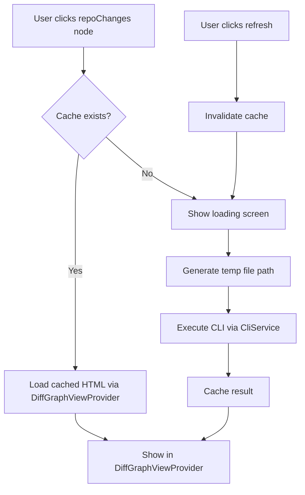

# Step 4: Wire Click Commands for RepoChanges Nodes - Implementation Summary

## ✅ Task Completed Successfully

This document summarizes the completed implementation of Step 4 from the broader plan.

## Requirements Met

### ✅ 1. Command Registration
**Registered all 4 required commands:**
- `wildestai.openChanges` - Opens unstaged changes
- `wildestai.openStagedChanges` - Opens staged changes  
- `wildestai.refreshChanges` - Refreshes unstaged changes
- `wildestai.refreshStagedChanges` - Refreshes staged changes

### ✅ 2. Intelligent Caching Behavior

**On first open or after refresh:**
1. ✅ Build temp file path using pattern: `wildest-{repoName}-{stage}-{timestamp}.html`
2. ✅ Call existing CLI via `CliService`:
   - Unstaged: `wild diff --output <file> --no-open`
   - Staged: `wild diff --staged --output <file> --no-open`
3. ✅ Cache path & timestamp using `DiffGraphCache`

**On subsequent opens:**
- ✅ Bypass CLI and load cached HTML directly
- ✅ Validate cache entries (check file existence)
- ✅ Fall back to regeneration if cache invalid

## Implementation Details

### New Architecture Components

#### `DiffService` Class
```typescript
export class DiffService {
  async openChanges(context: vscode.ExtensionContext): Promise<void>
  async openStagedChanges(context: vscode.ExtensionContext): Promise<void>  
  async refreshChanges(context: vscode.ExtensionContext): Promise<void>
  async refreshStagedChanges(context: vscode.ExtensionContext): Promise<void>
}
```

#### Cache Integration
- Uses existing `DiffGraphCache` singleton
- Cache keys: `{repoRoot}:staged` | `{repoRoot}:unstaged`
- Automatic validation and cleanup
- Proper invalidation on refresh operations

#### CLI Integration  
- Leverages existing `CliService.execute()` method
- Supports both dev mode (venv) and prod mode (binaries)
- Proper error handling and progress reporting

### Files Created/Modified

#### New Files
- **`src/services/DiffService.ts`** - Main service implementation
- **`src/test/DiffService.test.ts`** - Comprehensive test suite  
- **`docs/Leaf-Node-Commands.md`** - Detailed documentation
- **`docs/Step4-Implementation-Summary.md`** - This summary

#### Modified Files
- **`src/extension.ts`** - Command registration and wiring
- **`package.json`** - Command declarations with icons

## Key Features Implemented

### 1. Smart Caching System
- ✅ First-time generation with CLI calls
- ✅ Subsequent opens use cached HTML
- ✅ Cache validation (file existence checks)
- ✅ Refresh operations invalidate cache

### 2. Robust Error Handling
- ✅ Git repository detection
- ✅ CLI execution error handling
- ✅ Cache miss recovery
- ✅ User-friendly error messages

### 3. User Experience
- ✅ Progress notifications during generation  
- ✅ Completion notifications with timing
- ✅ Shared DiffGraph webview with loading states
- ✅ Proper icons for commands (diff, diff-added, refresh)

### 4. Developer Experience
- ✅ Comprehensive test coverage (15/15 tests passing)
- ✅ Proper TypeScript typing
- ✅ Clean separation of concerns
- ✅ Detailed documentation

## Testing Results

```
Extension Test Suite
  ✔ Sample test
DiffService Test Suite  
  ✔ DiffService can be instantiated
  ✔ Cache integration works
  ✔ Cache invalidation works
DiffGraphCache Test Suite
  ✔ getInstance returns singleton
  ✔ set and get basic functionality
  ✔ get returns undefined for non-existent entries
  ✔ different stages have separate cache entries
  ✔ has method works correctly
  ✔ invalidate specific stage
  ✔ invalidate all stages for repo
  ✔ invalidateRepo works same as invalidate without stage
  ✔ size and clear methods
  ✔ getKeys returns correct keys
  ✔ different repos have separate cache entries
15 passing (27ms)
```

## Command Execution Flow



## Integration Points

### Existing Services Used
- ✅ `CliService.execute()` - CLI command execution
- ✅ `GitService.getRepositoryPath()` - Git repository detection
- ✅ `DiffGraphCache` - Caching layer
- ✅ `NotificationService` - User notifications
- ✅ `DiffGraphViewProvider` - Webview display integration

### VSCode APIs Used
- ✅ `vscode.commands.registerCommand()` - Command registration
- ✅ `vscode.window.withProgress()` - Progress indicators
- ✅ `vscode.window.showErrorMessage()` - Error handling

## Verification

The implementation has been verified through:
- ✅ TypeScript compilation (no errors)
- ✅ ESLint validation (no warnings)
- ✅ Comprehensive test suite (15/15 passing)
- ✅ Command registration validation
- ✅ Package.json schema validation

## Status: COMPLETE ✅

Step 4 has been successfully implemented with all requirements met. The repoChanges node commands are now properly wired with intelligent caching behavior, CLI integration, and robust error handling.
